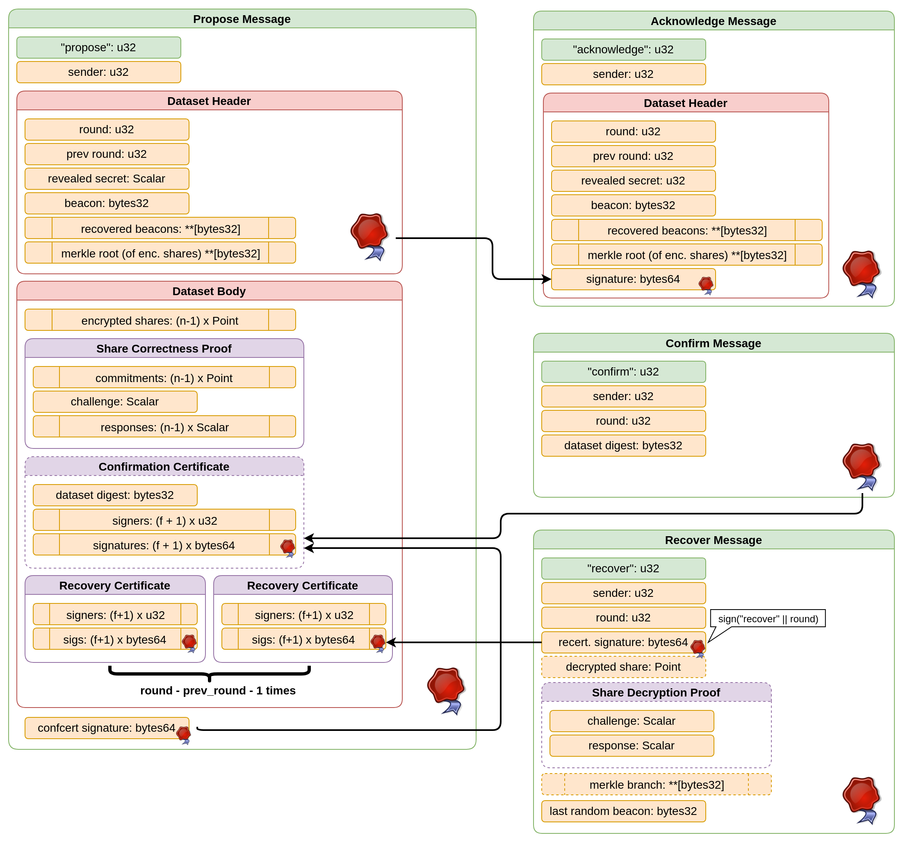
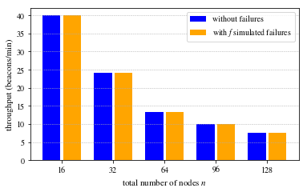
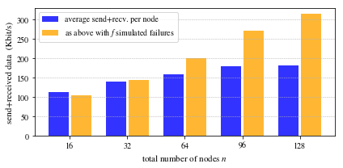
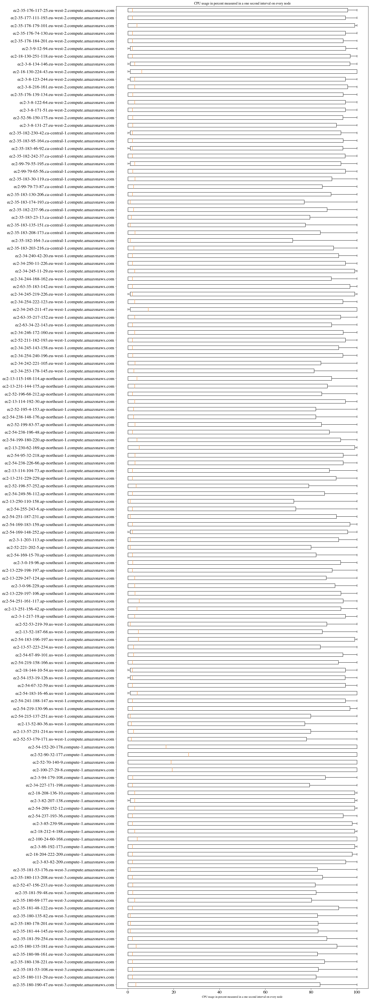
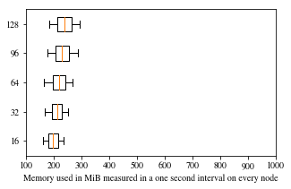
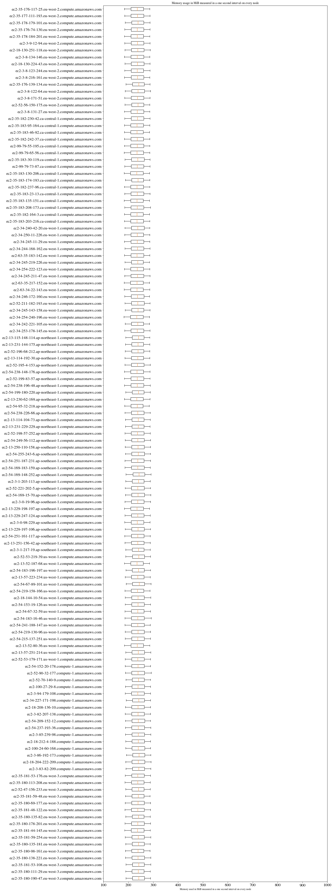
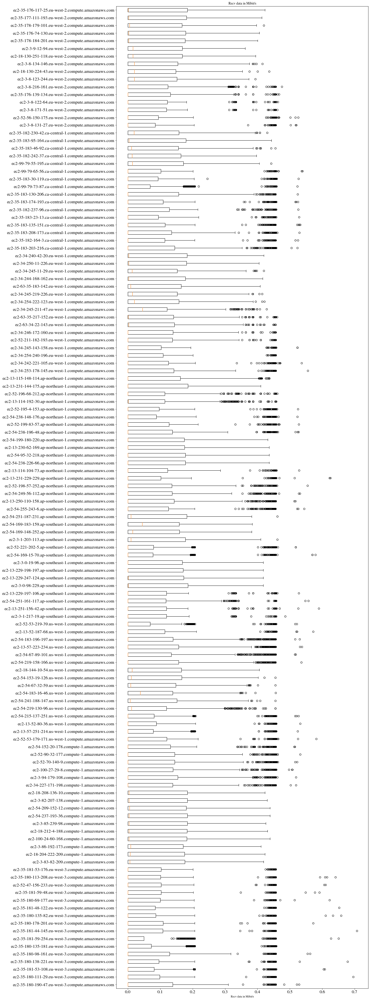

# HydRand

This is a python implementation of the HydRand protocol for generating publicly-verifiable randomness in a distributed fashion.
The corresponding research paper is available at [https://eprint.iacr.org/2018/319](https://eprint.iacr.org/2018/319). An updated version will appear shortly.
This work is a joint research project by my team members Aljosha Judmayer and Nicholas Stifter and myself, conducted at SBA Research and Vienna University of Technology under the supervision of Edgar Weippl.

## Security notice

Currently, the open source implementation provided in this repository is a proof-of-concept implementation and mainly used for performance evaluation.
While the main functionally,
including signatures checks and verification procedures of the messages,
have been fully implemented the code is still considered a prototype and **NOT SAFE TO USE IN PRODUCTION**. Please contact me or one of my team members at SBA research if you are interested in running HydRand in production.

## Flowchart

(Somewhat simplified) figure of the internals of the Hydrand protocol, from the view of an individual Hydrand node.

## Message Format

Overview of format of the messages exchanged by HydRand nodes.

## Performance evaluation

We tested the performance of the protocol using Amazon Web Services (AWS) with up to 128 EC2 instances of type `t2.micro` (1GB of RAM, 1 virtual CPU core, and a 60-80 Mbit/s internet connection) in different globally distributed datacenters.
We discuss our evaluation in the research paper [https://eprint.iacr.org/2018/319](https://eprint.iacr.org/2018/319).
In the following we provide additional metrics obtained during our performance tests.
The corresponding raw data is provided upon request (the collected files are bigger than the limit of this free git repository).

### Throughput

The following figure shows the troughput of the HydRand protocol benchmark runs for different configurations. The round duration was experimentally derived.
We tested the protocol in two settings: for the first setting we run the HydRand software as is and ensured that every single node was able to complete the protocol run successfully.
For the second settings we deliberately stopped f nodes during the execution of the protocol. In this case all remaining node are able to finished the protocol run successfully.

### Network bandwidth

The following figure shows the average bandwidth used by the HydRand nodes, again with and without simulated failures.

### CPU utilization

It can be observed, that the limiting resource in our evaluation was the vCPU of the AWS instances.
The following figure shows the overall CPU utilization in percent for different runs with the respective number of nodes on the x axis.

The following figure shows a normal run with 128 nodes.

### Memory utilization

The following figure shows the memory utilization of the AWS instances in MiB for different runs with the respective number of nodes on the x axis.

The following figure shows a normal run with 128 nodes.

### Network utilization

The following figures shows the sent data in Mbit/s for different runs with the respective number of nodes on the x axis.

The following figure shows the data received in a normal run with 128 nodes on every node.
The bursts show that almost all nodes have been selected as leader and broadcasted a propose message.

The following figure shows the data received in a normal run with 128 nodes on every node.

## Notes

### Depencencies

For running the software, `python3.7` and with the package `pyzmq` is required.
For executing all test cases we additionally require the `pytest` and `sympy` packages.
For developement we provide dependency files for the use with `pipenv`.

See also `./aws/setup-instance.sh` for a script which installs all the required dependencies to run HydRand on an Amazon EC2 instance.

### Configuration

Configuration files **FOR TESTING ONLY** can be generated for differnent number of nodes using the pyhton file `./hydrand/config.py`.
Notice that the script generates key files for all nodes and stores them in the `./config` directory.
It is **NOT SECURE** to use the script for setting up the protocol **IN PRODUCTION**.

In addition the scripts provided in the `./aws` folder automatically generate a network configuration file.

### Tesing locally

The available unit tests can be executed using `pytest` as a test runner.

For testing a high number of nodes on a single local machine the ulimit has to be increased,
e.g. `ulimit -n 4096`.  
See also `/etc/security/limits.conf`.

## Acknowlegdements

I would like to express my very great appreciation to my co-authors Aljosha Judmayer and Nicholas Stifter for the excellent collabortion and support throughout the design and implementation of this project, a variety of critical discussions, and their valuable contributions to the paper.
